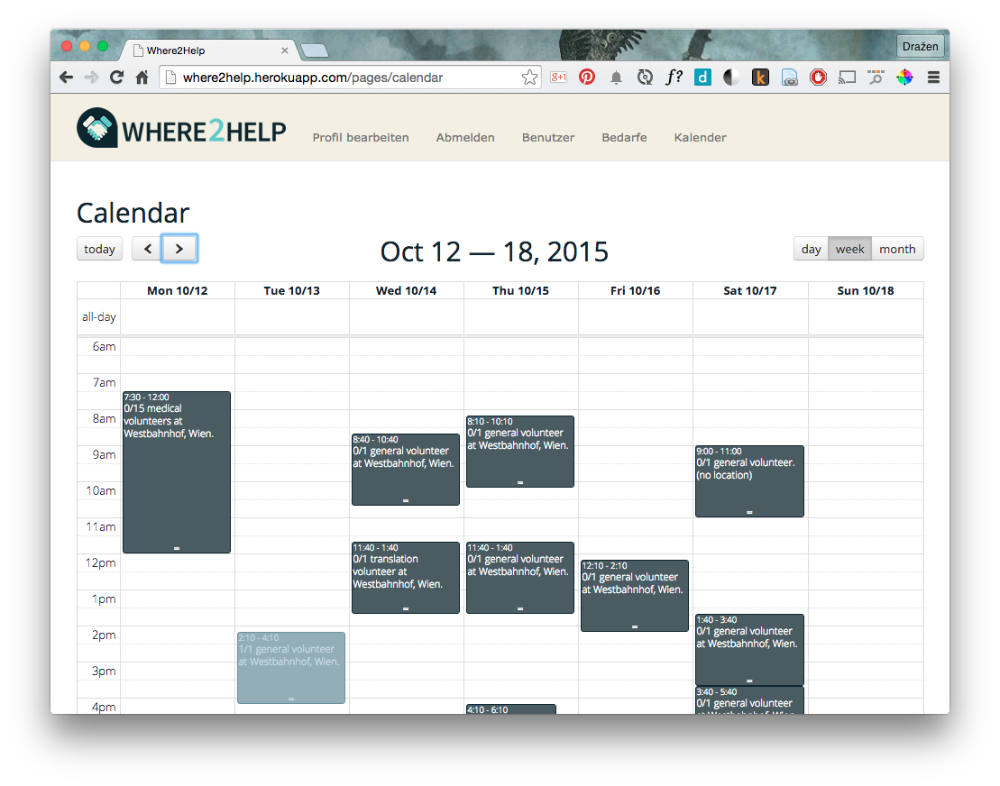
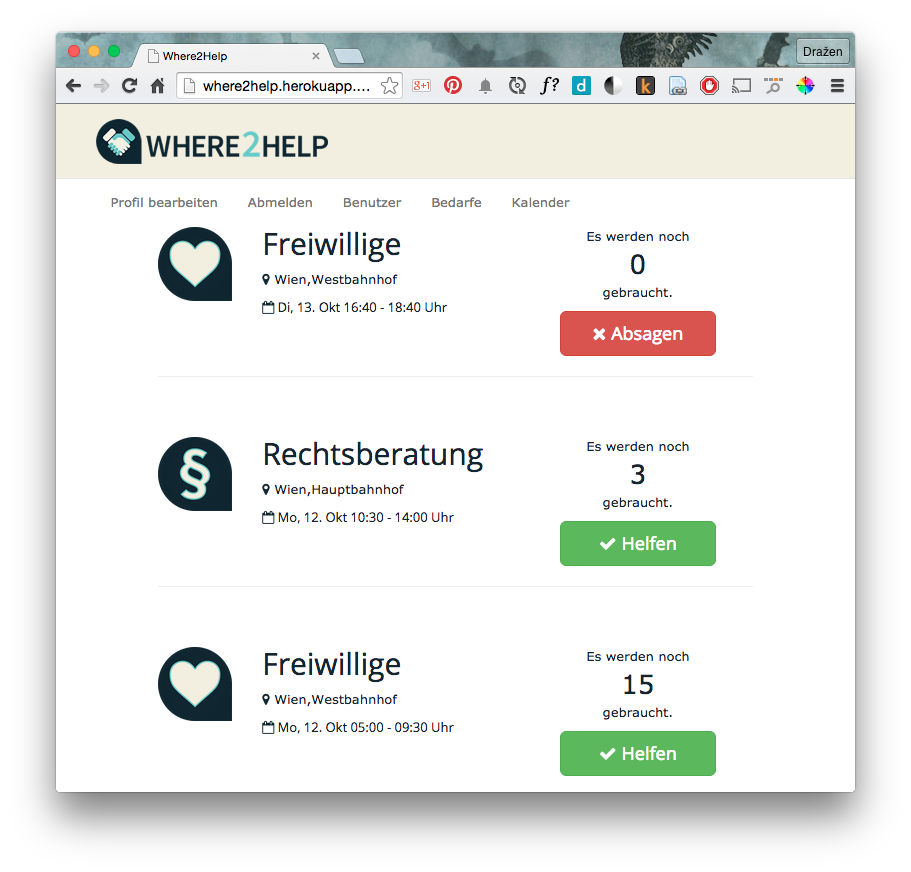

# where2help

Find the best way to volunteer and help refugees. Start by saying:

> I'm in!

Organisers can create a *need*, set its location, time and the number and type
of volunteers required.

Volunteers can see the needs in a list and join a need by clicking *I'm in*.

This way, volunteers applying for a need are registered (no volunteers will be
turned down on the spot due to too many people showing up) and the
organisers can keep track of those needs that still need more people.

The web app is getting its last fixes and is coming soon, along with an Android
and iOS app at the following URL:

<http://where2help.at>

Initial version of the web and mobile app was built in two days as part of the
[Refugee Hack Vienna](http://www.hackathon.wien/).

## Installation

__ENV Variables for configuration managment__

Your system environmental variables are kept in your `.env` file. There is an example of all of the vars you need in `.env.example`. You can copy this file to `.env` when you start and edit the vars to how you like your system setup.

If you need environment specific (eg. test, development) .env files, [look here](https://github.com/bkeepers/dotenv#multiple-rails-environments)
